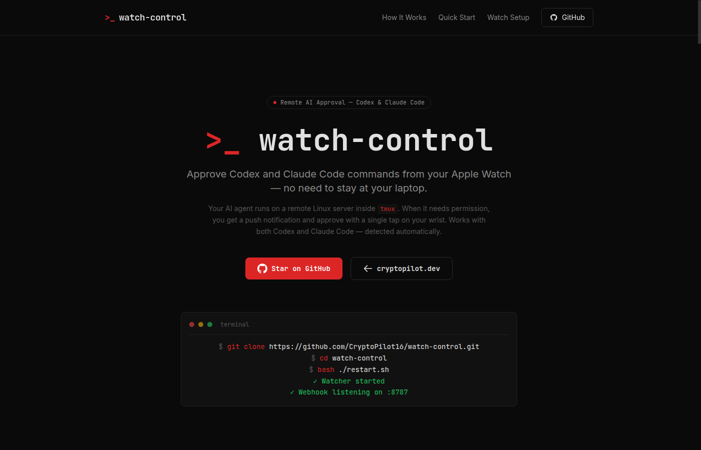

# watch-control

> Approve [Codex](https://github.com/openai/codex) and [Claude Code](https://github.com/anthropics/claude-code) commands from your Apple Watch.

[](https://cryptopilot.dev/watchcontrol)
[](LICENSE)



Your AI agent runs on a remote Linux server inside `tmux`. When it needs approval, a watcher script detects the prompt, auto-identifies whether it's Codex or Claude Code, and sends a push notification via [Pushover](https://pushover.net). A single tap on your Apple Watch fires a GET request to a local webhook, which injects the correct keystroke — `y` for Codex, `1` for Claude Code — and your agent continues.

Watch multiple tmux panes simultaneously to run Codex and Claude Code side by side.

---

## How it works

```
AI agent (tmux) → codex_watch.sh detects prompt → Pushover notification
     ↑                                                       ↓
approve_webhook.py injects keystroke          Apple Watch tap → GET /approve
```

1. **Agent needs approval** — Codex or Claude Code pauses and waits for input
2. **Watcher detects the prompt** — polls tmux output every 2s, identifies the agent automatically
3. **Push notification sent** — Pushover delivers it to your iPhone and Apple Watch
4. **You tap Approve** — iOS Shortcut fires a GET request to the webhook
5. **Webhook injects the keystroke** — correct key (`y` or `1`) sent to the right tmux pane
6. **Agent continues**

---

## Structure

```
watch-control/
├── approve_webhook.py        # HTTP webhook — validates secret, injects tmux keystrokes
├── codex_watch.sh            # Watcher — polls tmux, detects prompts, sends Pushover alerts
├── restart.sh                # Start/restart both services
├── .env.example              # Environment variable template
└── web/                      # Landing page source (Next.js, static export)
```

---

## Quick start

**Prerequisites:** Linux server with tmux + Python 3, [Pushover](https://pushover.net) account, [Tailscale](https://tailscale.com) installed, Apple Watch with Shortcuts app.

```bash
git clone https://github.com/CryptoPilot16/watch-control.git watch-control
cd watch-control
cp .env.example .env
# edit .env — fill in APPROVE_SECRET, PUSHOVER_APP_TOKEN, PUSHOVER_USER_KEY, APPROVE_PORT
bash ./restart.sh
```

Expose via Tailscale Serve (tailnet-only, no public port):

```bash
tailscale serve --bg https:443 /webhook/ http://127.0.0.1:<APPROVE_PORT>
```

Then set in `.env`:
```
APPROVE_URL=https://<your-machine>.ts.net/webhook/approve
```

---

## Environment variables

| Variable | Required | Default | Description |
|---|---|---|---|
| `APPROVE_SECRET` | yes | — | Shared secret for webhook auth |
| `PUSHOVER_APP_TOKEN` | yes | — | Pushover app token |
| `PUSHOVER_USER_KEY` | yes | — | Pushover user key |
| `APPROVE_URL` | yes | — | Full Tailscale URL for the approve endpoint |
| `TMUX_SESSION` | no | `codex:0.0` | Default tmux target pane |
| `TMUX_TARGETS` | no | `$TMUX_SESSION` | Space-separated list of panes to watch |
| `APPROVE_PORT` | no | `8787` | Webhook listening port |
| `COOLDOWN_SECONDS` | no | `30` | Min seconds between push notifications |

---

## Webhook endpoints

| Endpoint | Method | Description |
|---|---|---|
| `/approve` | GET/POST | Injects the queued approval keystroke into tmux |
| `/deny` | GET/POST | Sends Escape to the queued tmux pane |
| `/status` | GET/POST | Returns current queue depth |

Auth via `?secret=<APPROVE_SECRET>` query param or `X-Secret` header.

---

## Apple Watch setup

1. Find your Tailscale hostname: `tailscale status --json | python3 -c "import sys,json; print(json.load(sys.stdin)['Self']['DNSName'])"`
2. Build your approve URL: `https://<hostname>/webhook/approve?secret=<APPROVE_SECRET>`
3. Open **Shortcuts** on iPhone → new shortcut → add **Get Contents of URL** → paste the URL
4. Name it **Approve Codex** → tap the info icon → toggle **Show on Apple Watch**

---

## Security

The webhook listens on `127.0.0.1` only and is exposed exclusively over your Tailscale tailnet via `tailscale serve`. It is never reachable from the public internet. Every request must include the shared secret.

---

## Landing page

Live at [cryptopilot.dev/watchcontrol](https://cryptopilot.dev/watchcontrol)

```bash
cd web
npm install
npm run dev      # dev server
npm run build    # static export → out/
```

---

Built by [CryptoPilot16](https://github.com/CryptoPilot16) · [cryptopilot.dev](https://cryptopilot.dev)
